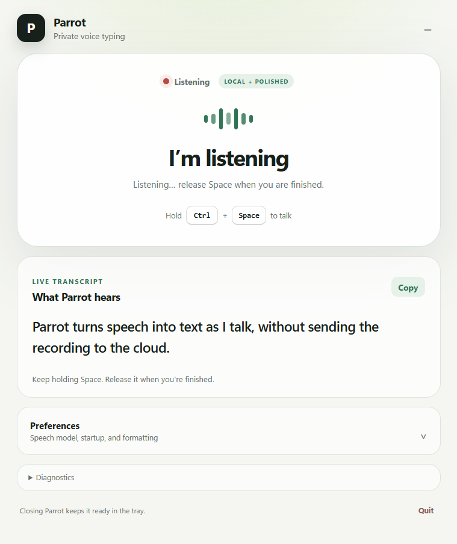

# Parrot

Private, local-first voice typing for Windows.

[**Download the latest Parrot.exe**](https://github.com/Carldtitan/Project-Parrot/releases/download/latest/Parrot.exe)

Hold `Ctrl+Space`, speak naturally, and release `Space`. Parrot shows the
transcript while you talk, finishes the full utterance locally, and pastes it
into the app you were using.



## Why I built it

Parrot explores whether fast, polished dictation can work without sending a
microphone stream to a cloud transcription service. It combines a native Rust
input and audio engine, a kept-alive local speech worker, and a small Electron
desktop shell.

The product work includes:

- rolling live transcription that preserves earlier words during long speech;
- full-utterance recognition before the final paste;
- global push-to-talk and clipboard-safe insertion;
- a non-focus-stealing overlay and persistent Windows tray process;
- an optional local formatter with a guarded raw-transcript fallback;
- benchmark-driven model selection; and
- a reproducible Windows installer and continuously updated GitHub release.

## Try it

Requirements: 64-bit Windows 10 or 11. A GPU is not required.

1. Download and run
   [Parrot.exe](https://github.com/Carldtitan/Project-Parrot/releases/download/latest/Parrot.exe).
2. Let Parrot download its local speech model on the first launch.
3. Focus a text field in any app.
4. Hold `Ctrl+Space`, speak, and release `Space`.

Parrot keeps running in the notification area when its window is closed.
Clicking the tray icon opens it again.

The installer is not code-signed yet, so Windows may show an **Unknown
publisher** warning. A SHA-256 checksum is attached to every release. Ollama
and Qwen are optional: transcription works without them.

## How it works

```text
Ctrl+Space + microphone
           |
           v
Rust hotkey/audio engine -----> live audio chunks
           |                          |
           |                          v
           |                  Parakeet ONNX worker
           |                          |
           |                 stable live transcript
           |                          |
           +---- full utterance ------+
                           |
                  optional local Qwen
                           |
                    guarded final text
                           |
                     paste into app
```

All speech recognition runs on the machine. The default engine is NVIDIA
Parakeet TDT 0.6B v3 through ONNX Runtime, with faster-whisper `small.en` as a
fallback. The optional formatter uses Qwen2.5 3B through a local Ollama server.

In the repository's CPU benchmark suite, Parakeet ran at approximately
`0.09–0.11` real-time factor across Common Voice, LibriSpeech Other, and
Earnings22. Results are hardware- and dataset-dependent; the raw reports are in
[`benchmarks/suite_100`](benchmarks/suite_100).

## Develop

You need Rust stable with the MSVC toolchain, Node.js, npm, and Python 3.12+.

```powershell
powershell -ExecutionPolicy Bypass -File scripts\setup_windows.ps1
npm install
npm start
```

To inspect only the interface without loading a speech model:

```powershell
npm run start:ui
```

Run the verification suite:

```powershell
cargo fmt --all -- --check
cargo test --locked
npm test
python -m unittest scripts.test_stt_worker
python -m compileall -q parrot scripts
```

## Package and release

Build the installer locally:

```powershell
powershell -ExecutionPolicy Bypass -File scripts\package_windows.ps1
```

GitHub Actions repeats the verification and packaging process after every
successful update to `main`. It publishes the installer as `Parrot.exe` on the
rolling `latest` release, so the download URL at the top of this page never
changes. A failed build cannot replace the last working release.

See [`docs/DISTRIBUTION.md`](docs/DISTRIBUTION.md) for the packaged layout and
clean-machine release checklist.
